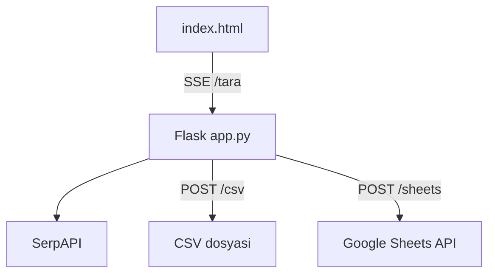

# Etkinlik Avcısı

[](https://www.python.org/)
[](https://flask.palletsprojects.com/)
[](LICENSE)
[](https://github.com/bekirkocaman/etkinlik-botu)

Konum ve kategoriye göre **Facebook, Instagram, LinkedIn, Eventbrite ve Meetup** üzerinde gelecek etkinlikleri tarayan Flask web uygulaması. Sonuçlar canlı akış (SSE) ile listelenir; CSV indirilebilir veya Google Sheets’e aktarılabilir.

---

## Özellikler

| Özellik | Açıklama |
|--------|----------|
| 🔍 SerpAPI arama | Kategori bazlı çoklu sorgu |
| 📅 Tarih filtresi | Geçmiş etkinlikleri otomatik eleme |
| 📡 Canlı sonuç | Server-Sent Events ile anlık kartlar |
| ⬇️ CSV export | Tek tıkla indirme |
| 📊 Google Sheets | Service account ile toplu kayıt |
| 📱 Mobil arayüz | Koyu tema, kategori chip’leri |

---

## Ekran görünümü

Ana sayfa: konum girişi, kategori seçimi, tarama ilerleme çubuğu ve platform rozetli etkinlik kartları.

---

## Mimari



---

## Kurulum

### 1. Depoyu klonlayın

```bash
git clone https://github.com/bekirkocaman/etkinlik-botu.git
cd etkinlik-botu
```

### 2. Sanal ortam

```powershell
python -m venv venv
.\venv\Scripts\activate
pip install -r requirements.txt
```

### 3. Ortam değişkenleri

```powershell
copy .env.example .env
```

| Değişken | Zorunlu | Açıklama |
|----------|---------|----------|
| `SERP_API_KEY` | Evet | [SerpAPI](https://serpapi.com/) anahtarı |
| `GOOGLE_SHEETS_ID` | Hayır | Sheets entegrasyonu için tablo ID |
| `GOOGLE_CREDENTIALS_FILE` | Hayır | Varsayılan: `kimlik.json` |
| `PORT` | Hayır | Varsayılan: `5000` |

### 4. Google Sheets (isteğe bağlı)

Detay: **[docs/GOOGLE_SHEETS.md](docs/GOOGLE_SHEETS.md)**

---

## Kullanım

```powershell
python app.py
```

Tarayıcı: **http://127.0.0.1:5000**

1. Konum girin (örn. `Macedonia`, `Istanbul`)
2. Kategorileri seçin
3. **Etkinlikleri Tara** → sonuçlar canlı gelir
4. **CSV İndir** veya **Sheets'e Gönder**

---

## API uçları

| Metot | Yol | Açıklama |
|-------|-----|----------|
| `GET` | `/` | Ana arayüz |
| `GET` | `/tara?konum=...&kategoriler=...` | SSE etkinlik akışı |
| `POST` | `/sheets` | JSON `{ "veriler": [...] }` → Sheets |
| `POST` | `/csv` | JSON `{ "veriler": [...] }` → CSV dosyası |

---

## Proje yapısı

```
etkinlik-botu/
├── app.py                 # Flask backend
├── requirements.txt
├── .env.example
├── templates/
│   └── index.html         # Arayüz
├── docs/
│   └── GOOGLE_SHEETS.md
└── .github/
    └── workflows/ci.yml
```

**Repoda olmamalı:** `.env`, `kimlik.json`

---

## Kategoriler

- 🔒 Siber güvenlik  
- 💻 Yazılım / teknoloji  
- 🎮 Oyun  
- 🎉 Eğlence  
- 📅 Genel etkinlik  

---

## Katkı & lisans

[Katkı rehberi](CONTRIBUTING.md) · [MIT License](LICENSE) · [Güvenlik](SECURITY.md)

**Bekir Kocaman** — [@bekirkocaman](https://github.com/bekirkocaman)
