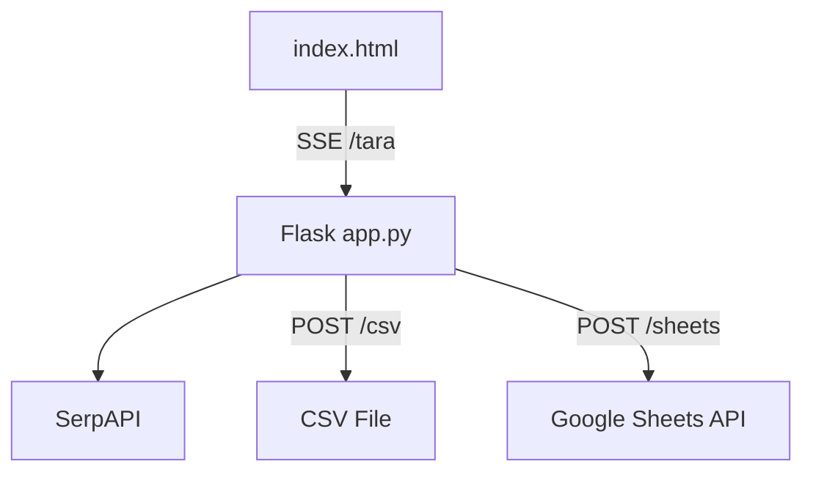

# Event Hunter

[](https://www.python.org/)
[](https://flask.palletsprojects.com/)
[](LICENSE)
[](https://github.com/bekirkocaman/etkinlik-botu)

A Flask web application that searches for upcoming events across **Facebook, Instagram, LinkedIn, Eventbrite, and Meetup** by location and category. Results are streamed live via SSE; exportable to CSV or Google Sheets.

---

## Features

| Feature | Description |
|---------|-------------|
| 🔍 SerpAPI Search | Multi-query search by category |
| 📅 Date Filter | Automatically filters out past events |
| 📡 Live Results | Real-time event cards via Server-Sent Events |
| ⬇️ CSV Export | One-click download |
| 📊 Google Sheets | Bulk export via service account |
| 📱 Mobile UI | Dark theme with category chips |

---

## Screenshot

Home page: location input, category selection, scan progress bar, and event cards with platform badges.

---

## Architecture



---

## Setup

### 1. Clone the repository

```bash
git clone https://github.com/bekirkocaman/etkinlik-botu.git
cd etkinlik-botu
```

### 2. Virtual environment

```powershell
python -m venv venv
.\venv\Scripts\activate
pip install -r requirements.txt
```

### 3. Environment variables

```powershell
copy .env.example .env
```

| Variable | Required | Description |
|----------|----------|-------------|
| `SERP_API_KEY` | Yes | [SerpAPI](https://serpapi.com/) key |
| `GOOGLE_SHEETS_ID` | No | Spreadsheet ID for Sheets integration |
| `GOOGLE_CREDENTIALS_FILE` | No | Default: `kimlik.json` |
| `PORT` | No | Default: `5000` |

### 4. Google Sheets (optional)

Details: **[docs/GOOGLE_SHEETS.md](docs/GOOGLE_SHEETS.md)**

---

## Usage

```powershell
python app.py
```

Browser: **http://127.0.0.1:5000**

1. Enter a location (e.g. `Macedonia`, `Istanbul`)
2. Select categories
3. **Scan Events** → results stream in live
4. **Download CSV** or **Send to Sheets**

---

## API Endpoints

| Method | Path | Description |
|--------|------|-------------|
| `GET` | `/` | Main interface |
| `GET` | `/tara?konum=...&kategoriler=...` | SSE event stream |
| `POST` | `/sheets` | JSON `{ "veriler": [...] }` → Sheets |
| `POST` | `/csv` | JSON `{ "veriler": [...] }` → CSV file |

---

## Project Structure

```
etkinlik-botu/
├── app.py                 # Flask backend
├── requirements.txt
├── .env.example
├── templates/
│   └── index.html         # Frontend UI
├── docs/
│   └── GOOGLE_SHEETS.md
└── .github/
    └── workflows/ci.yml
```

**Should not be in the repo:** `.env`, `kimlik.json`

---

## Categories

- 🔒 Cybersecurity  
- 💻 Software / Technology  
- 🎮 Gaming  
- 🎉 Entertainment  
- 📅 General Events  

---

## Contributing & License

[Contributing Guide](CONTRIBUTING.md) · [MIT License](LICENSE) · [Security](SECURITY.md)

**Bekir Kocaman** — [@bekirkocaman](https://github.com/bekirkocaman)
